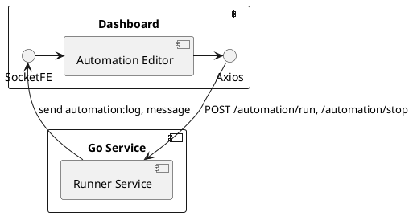

---
aliases:
---

The normative contract for AR-001 through AR-005 is [`Automation Runner Contract v1.md`](Automation%20Runner%20Contract%20v1.md).
The Go contract DTOs are in `internal/usecase/automation/contract.go`; matching
frontend run/event types are in `frontend/src/pages/editor/types/automationRun.ts`.

## Acceptance Criteria

- [ ] Automation procedure stored as yaml file and automation value store as ini config file.
- [ ] Runner treat block of item on procudure as step. 
- [ ] Step has multiple type that determine what job for runner to do as follow:
	- ssh
	- execute cli
	- file transfer
	- logging
	- rest api call
- [ ] When Runner executed, it should send log per step to dashboard
- [ ] User can stop on progress Runner
- [ ] Execution history is persisted
- [ ] Can run multiple automation job
- [ ] Automation step can have rollback command

## EPIC 1 - Building footing step for Runner

Runner live in go service, communication between frontend and runner are rest API and socket io.  here several new library required to be install or already exists in both frontend and backend

### Go Service

- Proccessing Yaml file: go.yaml.in/yaml/v3
- SSH connection: golang.org/x/crypto/ssh
- File Transfer: github.com/pkg/sftp
- Rest api client caller: net/http ✅ *(builtin)*
- CLI executor: github.com/spf13/cobra
- Logging: zerolog ✅ *(pkg/logger/zerolog.go)*
- Concurrency: goroutine + sync ✅ *(builtin)*
- Rest API: github.com/gin-gonic/gin  ✅
- SocketIO: github.com/zishang520/socket.io  ✅ *(pkg/socketio/hub.go)*

### Dashboard FE
rest
- Rest client API: axios
- SocketIO: socket.io-client

#### How it works



### Automation File Specification

- File written in yaml format
- We call the file as a Job
- each item represent step inside the job, here are the step type; **ssh, file-transfer, rest-api, cli-execute, log**
- Here minimal format of one item
	- note:
		- hosts is group host from config ini file, while local is built-in for local computer

``` yaml
- name: build local
  hosts: local
  tasks:
	- name: build jar
      type: cli-execute
      script: ${rootPath}/gradlew.bath bootJar --dry-run --mode=plain
```

- Example for SSH

``` yaml
- name: server stage
  hosts: dev
  tasks:
	- name: restart docker
      type: ssh
      script: `cd service/my-service; docker compose down; docker compose up -d`
```

- Example for FILE-TRANSFER

``` yaml
- name: server stage
  hosts: dev
  tasks:
	- name: copy to server
      type: file-transfer
      src:  ${rootPath}/build/libs/example.jar
      des: service/my-service/example.jar

```

- Example for REST-API

``` yaml
- name: verify from local
  hosts: local
  tasks:
	- name: get endpoint health
      type: rest-api
      curl-command: curl -x https://example.com

```

- Example for REST-API

``` yaml
- name: verify from local
  hosts: local
  tasks:
	- name: get endpoint health
      type: rest-api
      curl-command: curl -x https://example.com

```

- Example for REST-API

``` yaml
- name: verify from local
  hosts: local
  tasks:
	- name: get endpoint health
      type: log
      message: copy from ${rootPath} success

```

- here described the specification for config file (dot ini file)

```ini
[main]
type=ssh host=10.8.7.19 port=2290 username=root password=${password}
type=ssh host=10.8.7.20 port=2290 username=root password=${password}

[payment]
type=ssh host=10.8.8.19 port=2290 username=root password=${password}
type=ssh host=10.8.8.20 port=2290 username=root password=${password}
```

- note:
	- bracket meaning a group
	- type can be ssh and cert but right now we only manage ssh
	- it can accept runtime variable ${} that can be built-in or store at .env file

- runner can read runtime variable, that are store at .env variable
- env file always generated at same folder of config ini file
- runtime variable can also define at job file
```yaml
- name: verify from local
  hosts: local
  variables:
    - jarPath: ${rootPath}/../../../build/libs/example.jar
  tasks:
	- name: get endpoint health
      type: rest-api
      curl-command: curl -x https://example.com
```
- here is some built-in runtimeVariable
	- jobPath => path local of the job file (yaml)

### Runner flow diagram

```plantuml
@startuml
start
:request payload(jobId, configSelected); <<input>>
:send response ok; <<output>>
:find Job By id to \nrepo automation bbolt;
:read yaml file job from \nautomation entity to dto Job;
:read config ini file by configSelected to dto ConfigJob[];
while (for range Job.Group as g)
	while (for range config)
		while (for range g.Task t)
			switch (t.type?)
			case (ssh)
				: loadsshUtil;
				: ssh to config.getGroup(config);
				: execute command at t.script;
			case (file-transfer)
				: loadsftpUtil;
				: connect sftp to config connection;
				: file transfer t.Src to t.Desc;
			case (rest-api)
				: load net http;
				: execute t.curl-command with net/http;
			case (clie-execute)
				: load cli executor util;
				: execute t.script to cli executor util;
			endswitch
			:socket send message to frontend (name, type, stdout?, stderr?);
		endwhile
		:socket send message to frontend (connection host, username selected);
	endwhile
	:socket send message to frontend (group task finish);
endwhile
:socket send message to frontend (finish=true);


@enduml
```



## Frontend Correction - Automation Editor

The current frontend implementation was reviewed against this design in:

- `frontend/src/pages/editor/components/AutomationEditor.tsx`
- `frontend/src/layout/components/AutomationEditorHeader.tsx`
- `frontend/src/app/slices/automationSlice.ts`
- `frontend/src/layout/services/automation.ts`

The implementation currently behaves like an Ansible playbook editor. The intended feature is a custom automation runner. The following corrections are required before the frontend can satisfy this design.

### Confirmed Product Decisions

- The custom task runner is authoritative, not an Ansible-only runner.
- The primary `Run` and `Stop` controls belong in `AutomationEditorHeader`.
- YAML, inventory, and configuration changes remain persisted through collection push.
- Multiple independent automation jobs may run in parallel.
- Execution output is streamed as live per-step logs.
- Recent execution history is shown inside the automation editor.
- Rollback is declared per task.
- Runtime secrets are read from the `.env` file beside the inventory file.

### Current Frontend Gaps

#### `AutomationEditorHeader.tsx`

The header currently displays only the filename and catalog version. It is missing:

- `Run` action for the selected job.
- `Stop` action for the selected run.
- Running, stopping, failed, canceled, and completed state.
- Unsaved or unpushed change indicator.
- Run identifier and target/inventory summary.
- Clear disabled state while a job is running or YAML is invalid.

The Ansible catalog badge should be replaced with a custom runner/schema version badge unless Ansible compatibility remains an explicit requirement.

#### `AutomationEditor.tsx`

The editor currently contains an Ansible-oriented configuration panel (`limit`, `tags`, `extraVars`, check mode, and diff mode). These fields do not map to the custom task types in this document and must be replaced or explicitly mapped.

The editor is also missing:

- Custom YAML schema guidance and completion for `ssh`, `cli-execute`, `file-transfer`, `rest-api`, and `log`.
- YAML syntax and semantic validation before a run.
- Required-field validation by task type.
- Per-task rollback editing and validation.
- Selection of the inventory file and inventory group/host target.
- Runtime variable documentation and missing-variable errors.
- A live output panel grouped by job, host, group, task, and step.
- stdout and stderr separation.
- Step status, timestamps, duration, and error details.
- Stop/cancellation feedback.
- Rollback status and rollback output.
- An execution-history panel with immutable past logs.
- A visible save/push state before execution.

There is also a duplicate `PromptDialog` for inventory creation in the component. Only one instance should be rendered.

### Corrected Frontend Flow

1. Load the selected YAML job and its attached inventory files.
2. Parse and validate the YAML locally. Do not start a run when the document is invalid.
3. Resolve the selected inventory and target. `hosts: local` executes locally and does not require an inventory host.
4. Resolve runtime variables using the documented precedence: built-in variables, `.env` variables beside the selected inventory, job variables, then run-time overrides. Missing variables must fail validation before execution.
5. Detect unpushed YAML, inventory, or configuration changes. The Run action must either require collection push or perform an explicit push-before-run action; it must not silently execute stale persisted content.
6. Send `POST /automation/run` with a stable `runId` or receive one in the response.
7. Subscribe to Socket.IO events for that `runId` and job ID.
8. Render live events in the editor and update the header status.
9. Send `POST /automation/stop` with the `runId` when the user stops a run.
10. Persist the final result and event log as execution history.
11. If a task fails, execute its declared rollback according to the rollback policy and publish rollback events.

### Corrected Custom YAML Contract

The file format must formally define whether a YAML file contains one job or multiple jobs. The recommended shape is a list of jobs, with each job containing ordered tasks:

```yaml
- name: deploy service
  hosts: dev
  variables:
    artifact: ${jobPath}/build/app.jar
  tasks:
    - name: stop service
      type: ssh
      script: docker compose down
      rollback:
        type: ssh
        script: docker compose up -d
    - name: upload artifact
      type: file-transfer
      src: ${artifact}
      dest: /srv/app/app.jar
    - name: start service
      type: ssh
      script: docker compose up -d
```

Required contract corrections:

- Use one spelling consistently: `dest`, not `des`.
- Use one REST field consistently: prefer structured `method`, `url`, `headers`, and `body`; do not require a shell `curl-command` for a REST task.
- Use one task type spelling consistently: `cli-execute`, not `clie-execute`.
- Define `rollback` as a task object or a list of task objects; do not leave it as an unspecified command.
- Define whether `hosts` accepts one group, multiple groups, explicit hosts, or `local`.
- Define whether tasks run sequentially per host and whether hosts run concurrently.
- Define behavior when a task omits `type` or contains an unsupported type.

### Frontend State Required

Extend automation state with run records rather than one global running flag. A minimum run record should contain:

```text
runId
automationId
filename
status
startedAt
finishedAt
selectedInventory
activeStepId
events[]
error
rollbackStatus
```

Run records must be keyed by `runId` so independent jobs can run concurrently without mixing logs. The selected editor should display the active run for its automation file while allowing other runs to continue.

### REST and Socket.IO Contract

The API contract should be documented before frontend implementation:

```text
POST /collection/{collectionId}/automation/run
POST /collection/{collectionId}/automation/stop
GET  /collection/{collectionId}/automation/{filename}/runs
GET  /collection/{collectionId}/automation/{filename}/runs/{runId}
```

The run response must return a stable `runId`. Socket.IO events must include `runId`, `automationId`, and stable group/host/task identifiers. Recommended event names are:

```text
automation:run-started
automation:step-started
automation:log
automation:step-finished
automation:rollback-started
automation:rollback-finished
automation:run-finished
automation:run-error
automation:run-canceled
```

Every log event should include `timestamp`, `stream` (`stdout` or `stderr`), `message`, and the relevant group, host, and task identifiers. The frontend must unsubscribe when changing tabs or collections.

### Runtime Variables and Secrets

- The `.env` file is generated or maintained beside the selected inventory file.
- Secret values must never be rendered in plaintext in the editor, logs, toasts, or execution history.
- The backend resolves `.env` values where possible; the frontend sends variable names or non-secret overrides rather than copying secret values into persisted configuration.
- Document built-ins, including `jobPath`, and define escaping for literal `${...}` values.
- Define precedence and whether missing variables are validation errors or runtime errors.

### Execution History Requirements

Each history entry should include the run ID, job filename, inventory, start/end time, final status, task/host counts, options, error summary, and rollback summary. Historical logs must be immutable and openable without replacing the currently streaming run. Define retention and pagination, and persist history in BoltDB or another explicitly chosen backend store.

### Acceptance Criteria Additions

- [ ] Header shows Run and Stop controls with per-job running state.
- [ ] Independent jobs can run concurrently and their logs remain isolated.
- [ ] Run is blocked for invalid YAML or unpushed content.
- [ ] YAML validation identifies line, column, task, and field errors.
- [ ] All five custom task types have documented required fields and live output.
- [ ] Inventory groups, explicit hosts, and `local` execution behavior are defined and tested.
- [ ] Per-task rollback is validated, executed, streamed, and persisted.
- [ ] Socket subscriptions are cleaned up when changing automation tabs or collections.
- [ ] Stop targets one `runId` and produces a terminal canceled status.
- [ ] Execution history is persisted, paginated, and viewable from the editor.
- [ ] Secrets from `.env` are masked and excluded from logs and ordinary collection push content.
