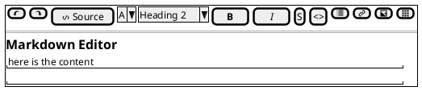

```plantuml
@startsalt
{
  {+
    { [<&action-undo>] | [<&action-redo>] | [<&code> Source] | ^A^ | ^Heading 2^ | [**B**] | [//I//] | [S] | [<>] | [<&list>] | [<&link-intact>] | [<&image>] | [<&grid-three-up>] }
    ===
    = Markdown Editor
    " here is the content                                         "
    "                                                             "
  }
  
}
@endsalt
```

